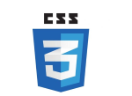

# About me

### Hi 👋

#### I am Jasvir Singh ! Software Developer graduate from Code Institute Ireland Diploma in Software Development !

A confident, and reliable frontend & backend web developer with an understanding of frontend & backend languages including HTML5 | CSS3 | JavaScript | React | jQuery | Node.js| MongoDB, Git, GitHub, Gitpod and Heroku and a full understanding of UX and UI.

 I enjoy learning new languages and frameworks as well as the problem solving aspect of writing code.

 I'm great at working with teams to get job done. My adaptability allows me to work in many different environments. I have impressive track record as a Team leader at my present employer Assistants for dig I Sverige (one of the leading private health & Social care organization, in Sweden).

 I am person who love to face new challenges!

An enthusiastic Full Stack web developer.

## **Frontend**

         

## **Backend**

 

<!--
**jas-sin82/jas-sin82** is a ✨ _special_ ✨ repository because its `README.md` (this file) appears on your GitHub profile.

Here are some ideas to get you started:

- 🔭 I’m currently working on ...
- 🌱 I’m currently learning ...
- 👯 I’m looking to collaborate on ...
- 🤔 I’m looking for help with ...
- 💬 Ask me about ...
- 📫 How to reach me: ...
- 😄 Pronouns: ...
- ⚡ Fun fact: ...
-->
